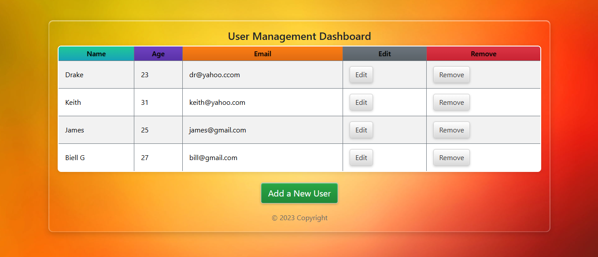

# User Management Dashboard

A React-based CRUD application for managing user records. Features a simple interface to add, edit, delete, and view employee details using React, React Hooks, React-Bootstrap, and React Router.

[](https://opensource.org/licenses/MIT)

## Table of Contents
- [Features](#features)
- [Screenshots](#screenshots)
- [Requirements](#requirements)
- [Setup](#setup)
- [Usage](#usage)
- [Project Structure](#project_structure)
- [Technologies](#technologies)
- [Contributing](#contributing)
- [License](#license)

## Features
- **View Users**: Display user records in a table with name, age, and email.
- **Add Users**: Create new user entries via a form.
- **Edit Users**: Update existing user details.
- **Delete Users**: Remove user records.
- **Navigation & Styling**: Uses React Router for routing and React-Bootstrap for a polished UI.

## Screenshots
| Dashboard |
|-----------|
|  |

## Requirements
- Node.js (v16 or higher)
- npm
- Git
- Web browser (e.g., Chrome, Firefox, Edge)

## Setup
1. Clone the repository:
   ```bash
   git clone https://github.com/johnkoshy/CRUD-Application-React.git
   ```
2. Navigate to the project directory:
   ```bash
   cd CRUD-Application-React
   ```
3. Install dependencies:
   ```bash
   npm install
   ```
4. Start the development server:
   ```bash
   npm start
   ```
   - Open `http://localhost:3000` in your browser.

## Usage
1. Access the app at `http://localhost:3000`.
2. Click **Add a new user** to create a new record.
3. Use the **Update** button to modify existing user details.
4. Click **Delete** to remove a user record.
5. Navigate the table to view all user entries.

## Project Structure
- **public/**:
  - **index.html**: Main HTML entry point.
  - **assets/**: Static assets (if any).
- **src/**:
  - **components/**: React components (e.g., `UserTable.jsx`, `UserForm.jsx`).
  - **App.jsx**: Main app component.
  - **App.css**: Global styles.
  - **index.jsx**: React entry point.
- **screenshots/**: Stores app screenshots.
- **package.json**: Project dependencies and scripts.

## Technologies
- **React**: Frontend framework with React Hooks.
- **React Router**: Client-side navigation.
- **React-Bootstrap**: Styling and UI components.
- **JavaScript**: Application logic.
- **CSS**: Custom styling.

## Contributing
Contributions are welcome! 🎉 Fork the repository, make changes, and submit a pull request. For issues or suggestions, open an issue on [GitHub](https://github.com/johnkoshy/CRUD-Application-React/issues).

## License
This project is licensed under the [MIT License](LICENSE).